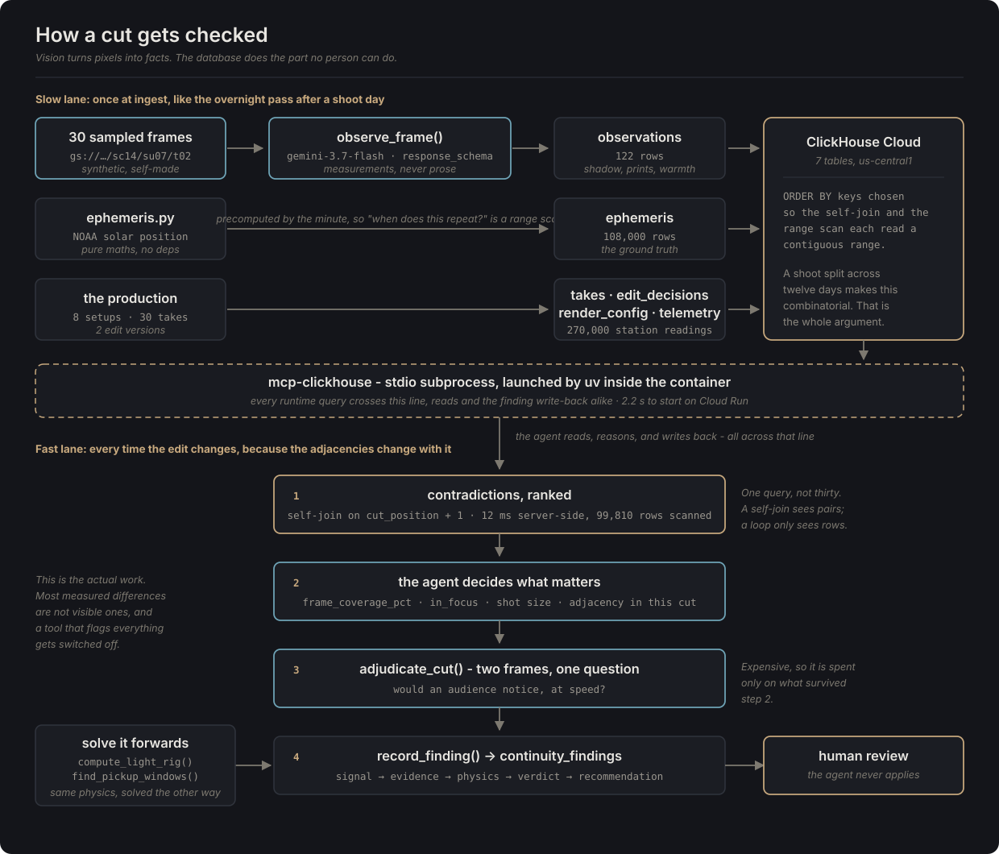

# CineMeridian

> A continuity analyst for film production, where a Gemini agent checks a cut against the physics of the day it was shot.


[Live console](https://cinemeridian-console-wswiws457a-uc.a.run.app) and
[MCP health check](https://cinemeridian-api-wswiws457a-uc.a.run.app/api/health/mcp)

Built for **Agentic Cinema: The Blockbuster Hackathon**, ClickHouse track.

## Table of Contents

- [What it is](#what-it-is)
- [How to test](#how-to-test)
- [Agent tools and MCP](#agent-tools-and-mcp)
- [Architecture](#architecture)
- [Running locally](#running-locally)
- [Deployment](#deployment)
- [Configuration](#configuration)
- [What is real and what is simulated](#what-is-real-and-what-is-simulated)
- [Results](#results)
- [Credits and licenses](#credits-and-licenses)
- [How this was built](#how-this-was-built)
- [License](#license)

## What it is

A film scene is shot out of order, over days or weeks, and then assembled. While
that happens the sun moves, the wind turns, the tide comes in, and footprints
accumulate in the sand. None of it is written down, because nobody can write it
down. Then an editor cuts two takes together and something is subtly wrong in a
way the audience feels and cannot name.

People are excellent at comparing one pair of shots. Five things defeat them,
and not one is about eyesight:

- **Combinatorial explosion.** Ten setups by eight takes, and the error only
  matters for the pairs that end up *adjacent in the cut* - which changes every
  time the edit is revised.
- **Time separation.** Coverage for one scene can be shot on day 3 and day 41.
- **Sub-threshold drift.** The audience feels something is wrong without being
  able to point at it.
- **Familiarity blindness.** An editor watches the same scene forty times and
  stops seeing it.
- **Things that are pure data.** Asset-version drift and LED volume state are
  not visible at all.

Continuity *looks* like a vision problem, so people build image comparators, and
those fail - because the real problem is combinatorial. CineMeridian uses vision
only to **turn pixels into facts**, and hands the actual work to an analytical
database.

Two ideas hold it together.

**Physics is the ground truth.** Sun and moon position follow deterministically
from (latitude, longitude, timestamp), so there is a correct answer nobody has
to be asked for. A useful side effect: a mis-slated take exposes itself, because
its shadows do not match the ephemeris for the time written on the slate.

**One calculation, read two ways.** For a practical shot, solve for *when* - the
window in which conditions will match again, for pickups and reshoots. For a CG
shot, solve for *how much* - the key-light azimuth, elevation and colour
temperature that will match the plate. Same arithmetic, opposite direction.

The agent **only ever recommends.** It does not modify an edit, submit a render,
or mark its own findings reviewed. Every finding lands in a queue for a human.

## How to test

No login is needed for anything below.

1. Open the **[live console](https://cinemeridian-console-wswiws457a-uc.a.run.app)**.
   It lists what the agent found in cut v14 of the demo scene. Click a finding to
   see the two frames it is about, side by side.
2. Press **Analyse v14** and watch the timeline on the right. That panel is the
   honest half of the demo: the queries the agent wrote, the candidates it
   dismissed, and the one adjudication it chose to spend. An investigation takes
   around three minutes.
3. Switch to **cut v13** and compare. The footage is identical in both; only the
   order changed. Most findings disappear, which is the argument for recomputing
   on every edit version rather than once at ingest.
4. Check
   **[`/api/health/mcp`](https://cinemeridian-api-wswiws457a-uc.a.run.app/api/health/mcp)**.
   It starts the `mcp-clickhouse` server inside the deployed container and
   reports whether the agent can actually reach ClickHouse through it.

A ClickHouse Cloud service sleeps when idle, so the first request after a quiet
spell can take the better part of a minute. It is waking, not broken.

## Agent tools and MCP

Every runtime query reaches ClickHouse through the **`mcp-clickhouse`** MCP
server, launched as a stdio subprocess and attached to the ADK agent as a
toolset - never through a database client in application code. Reads and the
finding write-back both travel that path.

The wiring is in [`codes/backpy/app/agent.py`](codes/backpy/app/agent.py); the
health endpoint that proves it works in the deployed container is
[`/api/health/mcp`](codes/backpy/app/main.py).

| Tool | Source | What it does |
|---|---|---|
| `run_query`, `list_tables`, `list_databases` | mcp-clickhouse | every read, and the finding INSERT |
| `compute_light_rig` | `tools/prescribe.py` | key light values a CG shot needs to match a practical take |
| `compute_render_error` | `tools/prescribe.py` | how far a submitted render sits from that, handling the 360° wrap |
| `find_pickup_windows` | `tools/prescribe.py` | when the sun returns to a take's geometry |
| `adjudicate_cut` | `tools/vision.py` | two frames at once: would an audience notice, at speed |
| `record_finding` | `tools/audit.py` | writes one finding for human review, through the same MCP session |

The scripts in [`scripts/`](scripts) do talk to ClickHouse over HTTPS, but they
are setup tooling that runs before the agent exists - schema, data load, the
restricted user - and are not part of the running system.

**The agent cannot break anything.** `mcp-clickhouse` is read-only unless write
access is enabled, and that flag is all-or-nothing: with it set, anything the
model puts in a query reaches the server, `DROP TABLE` included. So the boundary
is a grant rather than a flag. The agent connects as a ClickHouse user with
`SELECT` across the database and `INSERT` into `continuity_findings` alone -
verified by attempting the things it should refuse. Setup scripts use the admin
user, which never has a model attached to it.

## Architecture

```
┌──────────────────────────────────────────────────────────────┐
│  frontremix - Remix console (Cloud Run)                      │
│  findings map · evidence pair · agent timeline over SSE      │
└───────────────────────────┬──────────────────────────────────┘
                            │ REST + SSE
┌───────────────────────────▼──────────────────────────────────┐
│  backpy - FastAPI + Google ADK (Cloud Run)                   │
│                                                              │
│   cinemeridian_continuity_agent  ·  Gemini 2.5 Flash         │
│     MCPToolset ─────────────────────────────► mcp-clickhouse │
│     observe_frame / adjudicate_cut ──────────► Vertex AI     │
│     compute_light_rig / find_pickup_windows ─► ephemeris.py  │
│     record_finding ──────────────────────────► mcp-clickhouse│
│                                                              │
│   ephemeris.py - sun, moon, tide. Pure maths, no deps.       │
└──────────┬────────────────────────────────┬──────────────────┘
           │ MCP (stdio)                    │ Vertex AI
┌──────────▼─────────────┐   ┌──────────────▼──────────────────┐
│  ClickHouse Cloud      │   │  Gemini 2.5 Flash               │
│  7 tables              │   │  perception + adjudication      │
└────────────────────────┘   └─────────────────────────────────┘
                             ┌─────────────────────────────────┐
                             │  GCS - synthetic frames         │
                             └─────────────────────────────────┘
```

The pipeline runs in two lanes. The **slow lane** - perception into relational -
runs once at ingest, standing in for the overnight pass after a shoot day. The
**fast lane** - hunting contradictions - runs every time the edit changes, and
is the only one that has to be quick.



Seven ClickHouse tables ([`sql/001_schema.sql`](sql/001_schema.sql)). The
`ORDER BY` keys are the design, not decoration: the self-join of observations of
the same story beat across different takes and the range scan over precomputed
ephemeris each read a contiguous range. The queries the agent starts from, with
the reasoning behind each, are in
[`sql/010_queries.sql`](sql/010_queries.sql).

**Repository layout.** `git init` runs at the root of the working folder, so the
repository root is the project root. Application code sits under `codes/` rather
than at the top level; `LICENSE` stays at the root because that is what the
rules require and what GitHub reads for the licence badge.

```
sql/
  001_schema.sql             the seven ClickHouse tables
  010_queries.sql            the tested queries, with their reasoning
scripts/
  generate_telemetry.py      simulated environment data (ephemeris + weather)
  generate_production.py     the scene: takes, edits, render configs, answer key
  make_plates.py             base plates, from Gemini image models
  composite_variants.py      the controlled variables, composited exactly
  observe_frames.py          the perception pass
  apply_schema.py            create the schema (setup only)
  create_agent_user.py       the restricted user the agent runs as (setup only)
  load_data.py               load the CSVs (setup only)
  verify_mcp.py              prove ClickHouse is reached through MCP
  run_analysis.py            drive one investigation from the command line
  score_findings.py          score findings against the planted errors
codes/
  backpy/                    FastAPI + Google ADK agent
    app/
      agent.py               the agent, and its mcp-clickhouse toolset
      ephemeris.py           sun/moon/tide maths - pure, no dependencies
      prompts.py             the instruction, and the analysis task
      settings.py            configuration from the environment
      tools/                 vision, prescribe, audit, agent_tools
    tests/
  frontremix/                Remix continuity console
assets/
  plates/                    the eight base plates, and their hand-measured anchors
  frames/sc14/su01/t03/      one master take, all eight frames, head to tail
  frames/sc14/su07/t02/      the footprint insert, the same
  ground_truth.json          the planted errors, so a hit rate can be checked
```

## Running locally

Requires Python 3.12+, `uv`, Node 20+, a Google Cloud project with Vertex AI
enabled, and a ClickHouse Cloud service in the same region (`us-central1`).

```bash
python -m pip install -r codes/backpy/requirements-dev.txt
```

Create the schema, the restricted agent user, and the simulated production.
All of this is **setup only** - runtime access goes through MCP:

```bash
python scripts/apply_schema.py
python scripts/create_agent_user.py
python scripts/generate_telemetry.py --out data/
python scripts/generate_production.py --out data/
python scripts/load_data.py --data data/
```

Check the part the track actually requires:

```bash
python scripts/verify_mcp.py
```

Render the frames and run the perception pass. This is the slow lane - one
Gemini call per frame, writing the observations the queries then work on:

```bash
python scripts/make_plates.py --setup su01 --candidates 3
python scripts/make_plates.py --rest
python scripts/composite_variants.py --all
python scripts/observe_frames.py --frames assets/frames --out data/ --upload
python scripts/load_data.py --data data/
```

Run an investigation, then score it against the planted errors:

```bash
python scripts/run_analysis.py --edit-version v14
python scripts/score_findings.py --edit-version v14
```

Tests:

```bash
python -m pytest codes/backpy
```

Both services, on ports nothing else is using:

```bash
python -m uvicorn app.main:app --port 8090
```

```bash
npm --prefix codes/frontremix run build && CINEMERIDIAN_API_URL=http://127.0.0.1:8090 PORT=3100 npx --prefix codes/frontremix remix-serve codes/frontremix/build/server/index.js
```

## Deployment

Two Cloud Run services, built by Cloud Build. Secrets go through Secret Manager,
never through `--set-env-vars`, and there is no service account key file
anywhere - the runtime uses the service account directly.

```bash
gcloud builds submit codes/backpy --tag us-central1-docker.pkg.dev/$PROJECT/cinemeridian/cinemeridian-api:latest
```

```bash
gcloud run deploy cinemeridian-api --image us-central1-docker.pkg.dev/$PROJECT/cinemeridian/cinemeridian-api:latest --service-account cinemeridian-sa@$PROJECT.iam.gserviceaccount.com --allow-unauthenticated --memory 2Gi --cpu 2 --timeout 900 --concurrency 8 --set-secrets CLICKHOUSE_PASSWORD=clickhouse-password:latest,CLICKHOUSE_AGENT_PASSWORD=clickhouse-agent-password:latest
```

```bash
gcloud run deploy cinemeridian-console --image us-central1-docker.pkg.dev/$PROJECT/cinemeridian/cinemeridian-console:latest --allow-unauthenticated --memory 512Mi --set-env-vars CINEMERIDIAN_API_URL=$API_URL,GCS_ASSET_BUCKET=cinemeridian-assets
```

The timeout is 900 seconds because one investigation takes around three minutes
and the 300-second default cuts it off. Concurrency is low because each request
holds an MCP subprocess.

Two things the backend image must carry, both learned by watching it fail:

- **The `uv` binary**, copied from `ghcr.io/astral-sh/uv`. Without it the agent
  starts cleanly, answers questions, and never reaches the database at all.
- **`UV_CACHE_DIR=/tmp/uv-cache`**, because `/tmp` is the writable path in the
  container. Pre-installing `mcp-clickhouse` at build time drops MCP startup
  from 8.6 seconds to 2.2.

## Configuration

Copy [`.env.example`](.env.example) into `credentials/gcp.env` and
`credentials/clickhouse.env`. Both are gitignored; the `credentials/` folder is
never committed under any circumstances.

| Variable | Purpose |
|---|---|
| `GOOGLE_CLOUD_PROJECT` | project that owns Vertex AI and the asset bucket |
| `GOOGLE_CLOUD_LOCATION` | `us-central1`, matching ClickHouse and the bucket |
| `CINEMERIDIAN_GEMINI_LOCATION` | `us`. Gemini 3 is not served from a plain regional endpoint |
| `GOOGLE_GENAI_USE_VERTEXAI` | `true` - Vertex AI, not the developer API |
| `GOOGLE_CLOUD_QUOTA_PROJECT` | set explicitly, so this project does not depend on the machine-wide ADC quota project that every local project shares |
| `GCS_ASSET_BUCKET` | where synthetic frames live |
| `CINEMERIDIAN_MODEL` | `gemini-3.7-flash` |
| `CLICKHOUSE_HOST` / `PORT` / `USER` / `PASSWORD` | admin credentials, used by setup scripts only |
| `CLICKHOUSE_AGENT_USER` / `AGENT_PASSWORD` | the restricted user the agent runs as, created by `create_agent_user.py` |

Local development uses ADC (`gcloud auth application-default login`); Cloud Run
uses the runtime service account. No JSON key is ever downloaded.

Safety filters are set explicitly rather than left at whatever the default is
on the day, in [`tools/vision.py`](codes/backpy/app/tools/vision.py) and on the
agent. The realistic failure here is not unsafe output - every image is a beach
plate this project generated - but a *false* block: a frame refused for a
reason nobody can inspect silently becomes a missing observation and a
contradiction the agent never sees.

## What is real and what is simulated

- All footage is **synthetic and self-made**. The base plates come from Gemini
  image models on Vertex AI, generated under flat overcast light; every variable
  in dispute - shadow direction and length, colour temperature, footprint count,
  waterline - is composited on afterwards at a value we chose. No film or
  broadcast material is used anywhere.
- There is no real production, no real crew, and no real film. *The Tide Line*
  does not exist.
- Sun and moon positions are **real astronomy** (NOAA solar position algorithm,
  in [`ephemeris.py`](codes/backpy/app/ephemeris.py), no dependencies).
- **Tide is simulated** - two harmonic constituents against an arbitrary epoch.
  Weather telemetry is simulated too, from a physical afternoon model rather
  than a random walk. Neither is a forecast for any real place, and nothing in
  the demo presents them as one.

## Results

The continuity errors in the demo scene are planted deliberately by
[`generate_production.py`](scripts/generate_production.py), so there is an answer
key ([`assets/ground_truth.json`](assets/ground_truth.json)) and "the agent found
N of M" is a claim that can be checked rather than asserted. The key never enters
a prompt, a database table, or a file path - if the answers leak through a path,
the score means nothing.

On the current scene the agent finds **four of five** planted errors, including
the hardest one: the take whose slate is seventy minutes wrong, caught because
its shadows disagree with the ephemeris for the time written on it. It also
records one finding nobody planted, a waterline that recedes across a cut,
which is real drift rather than a false positive. It misses one cross-take
shadow drift.

Numbers worth quoting, all measured rather than estimated:

| | |
|---|---|
| Match-window query | **12 ms** server-side, scanning 99,810 rows |
| MCP startup on Cloud Run | **2.2 s** |
| Data in ClickHouse | 108,000 ephemeris rows, 270,000 telemetry rows, 122 observations |
| The pickup window it finds | **5 minutes a day, for 8 days**, five weeks out |

**What the vision pass can and cannot do.** Measured against the answer key,
Gemini reads shadow *direction* to within a few degrees once a shadow is long
enough to have one and small enough to fit in frame, and **underestimates
extreme lengths by roughly forty percent**. A shadow occupying half a percent of
frame produced a sixty-eight degree error reported at 0.90 confidence, so
`frame_coverage_pct` is the filter to trust, not `confidence`.

There is a harder limit, and it is geometry rather than model quality. In a
medium shot, where the figures are large, a shadow two or three times their
height does not fit on screen at all: it runs off the edge, or across foreground
dune grass that stands between the camera and the figures. Eleven of the thirty
frames are in that position, and the compositor marks them
(`shadow_fits_in_frame: false`) rather than drawing a smear the vision pass
would then dutifully mis-measure. This is not an artefact of synthetic footage.
The same is true of real coverage: a raking shadow in a medium shot is simply
not in the frame. So shadow evidence comes from the wides, and the reverses
carry colour temperature, footprints and waterline instead. The cross-take drift
finding needs no vision at all - capture time joined to computed physics is
enough.

### Bringing your own footage

The demo scene is synthetic so that there can be an answer key. To show the
method works on footage nobody here has seen, `/try` lets somebody build a
production of their own: between two and six clips in the order they would be
cut, and then the same agent investigates it.

Each clip becomes a take in ClickHouse. The frames a cut actually touches, the
last of one shot and the first of the next, become observations; an ephemeris
is computed for the window and place the files claim; the order the clips were
put in becomes the cut list. Then the agent runs on it through the same MCP
server and the same console renders what it asked and what it filed. It is not
a rendering of the demo, it is the demo's machinery on someone else's footage.

Measured against the deployed service, two takes: ingest in 209 seconds, then
sixteen queries, two visual adjudications and one recorded finding in 349.

The writing is done by a second ClickHouse user holding INSERT on exactly four
tables. The agent may read everything and write findings; it must never be able
to write a take or an ephemeris row, because those are the evidence it reasons
about, and a model that can edit its own evidence is not an auditor.

A gate runs in front of all of it. Continuity is a rule about a scene, so two
shots in different places are a scene change rather than a fault: those joins
are named and set aside before anything expensive starts. It takes a majority
of the readings to stop an analysis and only a tie to continue it, because
refusing work somebody asked for is the more expensive mistake.

Keeping the frames is the visitor's choice, and the checkbox says what it
actually buys. Without stored frames the agent reads numbers but cannot see
pictures, and it said so itself on the first run: `frame_uri` is empty, so the
visual adjudication had nothing to point at. With them, it looked at the frames
and adjudicated twice. They are deleted after 24 hours by a lifecycle rule on
the bucket, not by good intentions.

Neither video is uploaded. The browser parses the MP4 boxes itself for
`creation_time` and the `©xyz` location atom, decodes the file, and sends two
JPEG frames. A hundred megabyte clip is not a hundred megabyte upload, and the
honest answer to "where does my footage go" is nowhere.

Three things were learned by pointing this at real frames rather than reasoning
about it, and all three changed the code:

**One reading of a frame is not a measurement.** Asked five times about a single
unchanged frame, the model answered between 1.2 and 2.6 for the same shadow. On
a pair sitting near the tolerance that spread flipped the verdict three times
out of five: the same two files, the same timestamps, a different answer. Frames
are now read three times and the median is kept, which makes repeated runs on
the same evidence agree. That is the least a tool can offer before it tells
somebody their timestamps are wrong.

**A comparison that cannot fail is not a pass.** Shadow length is the cotangent
of solar elevation, so it is nearly flat at midday and steepens sharply towards
the horizon. The same seven-second cut is a searching test in the last hour of
light and almost no test at noon: a timestamp there would have to be **102
minutes** wrong before the shadows could show it, against **10 minutes** near
dusk. So every verdict now carries its own reach, and a cut where nothing could
have failed is reported as inconclusive rather than clean.

**Read the ratio, not the length.** The vision pass compresses long shadows
badly: a true 4.85 comes back near 1.45, a true 2.12 near 1.30. Judged alone
both are hopeless. Judged against each other much of the error divides out,
which is the same argument the rest of the system rests on. It is not free -
the compression flattens real differences too, so this errs towards missing an
error rather than inventing one, which is the right direction for a tool an
editor is meant to trust.

### The second signal: what changed on the ground

The sun answers when a shot was filmed and will not be argued with. It has
nothing to say about a bag left in frame, a mark on the sand, or footprints that
went missing between takes. So `/try` carries a second check, reported beside
the physics and never blended into it, because a soft answer must not be allowed
to dilute a hard one.

The method is one image rather than two. Every wobble measured in this project
came from describing two frames separately and then differencing the
descriptions: the same shadow read 1.2 and then 2.6 on an unchanged frame. Put
both frames side by side under a shared grid and the model is no longer
measuring twice, it is comparing, which is a different and far easier question.

That difference is measurable. A mark was planted on the sand of one frame,
small enough that a person had to point at it with an arrow. Across three grid
sizes and eight runs the model named the same cell every time, with no false
positives, and it did not report the footprint texture differences that were
expected to drown it. Nothing else in this project has been that repeatable.

Two things follow from the measurements rather than from taste. The grid is four
across and three down, not finer: a finer grid buys no precision, because the
model volunteers where inside a cell a mark sits without being asked, while a
mark straddling a boundary risks being reported as gone from one cell and
arrived in another. And confidence came back as 0.85 on every single run, so it
carries no information and is not used as a filter, which is the same lesson the
frame observations taught.

The finding is drawn on the frame rather than described. "A dark smudge in C3"
asks a reader to find the cell and then hunt inside it; a box asks them to look.

### Tests

The two browser-side pieces have their own tests, run with `npm run test:lib`
in `codes/frontremix`. The MP4 reader is driven against containers assembled
byte by byte rather than against a real clip: they carry no video at all, which
is the point, since everything the reader looks at lives in `moov` and a file
that is nothing but a correct `moov` makes every byte one somebody chose. The
frame planner is tested separately, because the decoding needs a browser but
the choosing does not, and the choosing is where a mistake would be silent.

Measured on the demo frames, three runs each: an honest seven-minute cut comes
back consistent every time (agreement 0.94 to 1.41 against a tolerance of 1.67),
and the take with the seventy-minute slate error comes back suspect every time
(2.06 to 2.75). The gap between them is the working margin.

**On model choice.** Everything runs on `gemini-3.7-flash`, measured against
`gemini-2.5-flash` rather than assumed better. On the same five frames with a
known answer, shadow direction error fell from 36.6 degrees to 13.4, footprint
counts went from wild (0, 6, 7, 34 against a truth of 2, 4, 6, 14) to nearly
exact, and the full investigation went from three of five planted errors to
four, picking up the mis-slated take it had never previously caught. It also
spent four visual adjudications where the older model spent one.

One trap worth naming: Gemini 3 models are served from the `global` endpoint
and the `us` and `eu` multi-regions, **not** from a plain regional one. Calling
`gemini-3.7-flash` at `us-central1` returns a 404 that reads exactly like a
permissions problem and is not one. ClickHouse and the asset bucket stay in
`us-central1`; only the model calls leave it.

Which of those pools you ask turns out to matter, and it is the only lever
there is. Gemini 3 models carry no per-project rate quota: the project's quota
list has rows for 1.5, for `gemini-pro`, for the TTS models, and nothing at all
for `gemini-3.7-flash`, because it runs on capacity shared between customers
and allocated as it goes. There is no increase to request and paying more does
not buy more. Measured, three concurrent reads, two bursts each: `us` answered
the first burst and lost the whole second one, zero of three; `global` answered
six of six. A single call is slower there, about 27 seconds against 15, which
is a bargain against a refusal that costs up to ninety seconds of backoff.
Moving the agent to `global` took a run that had not finished in ten minutes
down to 349 seconds.

None of that sinks the design, and the reason is worth stating plainly: the
system compares takes against takes, never against absolute truth, so a
systematic bias cancels. The one place absolute values matter - a mis-slated
take - is handled by normalising each take against the median of its own setup,
because framing is identical within a setup and the bias travels with framing.

## Credits and licenses

- **Agent Development Kit**, installed through
  `google-cloud-aiplatform[adk]`, which is the path the hackathon's own setup
  instructions give. The agent is an ADK `LlmAgent` with an `McpToolset`; see
  [`codes/backpy/app/agent.py`](codes/backpy/app/agent.py).
- **google-genai** and **Vertex AI**: Gemini 3.7 Flash for perception,
  adjudication and the agent itself, Gemini 3 Pro Image for the base plates.
  This project uses no AI SDK from any other provider.
- **[mcp-clickhouse](https://github.com/ClickHouse/mcp-clickhouse)** - ClickHouse,
  Apache 2.0. Run as a stdio subprocess; not vendored.
- **ClickHouse Cloud** - the analytical database.
- **FastAPI**, **uvicorn**, **Pillow**, **Remix**, **React** - their respective
  open source licences.
- Solar position follows the **NOAA** algorithm, implemented from the published
  method rather than copied from any package.

## How this was built

The order was deliberate: physics first, then data, then the agent, then
pictures. The ephemeris engine and its tests came before anything else, because
everything downstream compares against it - and its tests check facts that hold
independently of the implementation (declination at the solstices, the geometry
of solar noon, the shape of the cotangent) rather than numbers copied from a
previous run.

Three findings changed the design:

**The shoot dates had to straddle a solstice.** With the original September
dates the match-window query returned *nothing*, and the reason is physics
rather than a bug: sun geometry repeats when declination repeats, and
declination is symmetric about a solstice. An early-September shoot finds its
mirror in April, seven months out. Moved to early December, the window lands
five weeks later - and it is five minutes a day for eight days, which is a far
better answer than a comfortable one. That is also real production advice: if an
exterior scene may need pickups, schedule it near a solstice.

**An image model cannot be asked for "the same scene, one variable changed."**
Ask twice and you get two different beaches. So the model supplies only what
must look real and never changes - sand, sea, sky, figures - under flat overcast
light, and everything in dispute is composited on afterwards from numbers we
choose. Overcast is load-bearing: a golden-hour plate arrives with shadows baked
in at an angle nobody picked and cannot remove.

**Vision is not precise enough for geometry, and does not need to be.** Asking
Gemini to locate the figures returned boxes offset and twice their true height,
so anchors are measured by hand once per plate. Vision is used for what it is
good at: relative and magnitude judgements, and the one question a database
cannot answer - would an audience notice, at speed.

## License

MIT - see [LICENSE](LICENSE).
